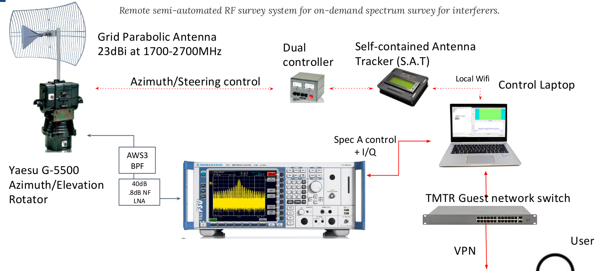

# RFSS
NOAA - RF Survey System -- rsAutonomous.py

(rsAutomated-StartStop.py can be used to manually schedule recording)

This code is intended to be run on the RF Survey System (RFSS) located at different earth stations to evaluate RF Interference (RFI) anomolies that may exist in the environment prior to and during a meteorological satellite pass.  

Instruments for automation include the R&S FSV3000 Spectrum Analyzer configured for both Spectrum and IQ sweeps to measure prior to and during a satellite pass. Due to instrument usage, this code requires both rsInstrument and rsVisa.  rsInstrument can be installed via requirements.txt and rsVisa can be downloaded directly from R&S or from the Tools folder.

Additionally, you will need to ensure you are synced in time.  Preferred way is with systemd-timesyncd and NTP=time.nist.gov in /etc/systemd/timsyncd.conf.

Currently, this is designed to capture 16ms IQ samples every 8 seconds while a Griddy antenna attached to Yaesu G5500 rotor tracks the satellite across the sky.  The Yaesu and schedule is controlled by CSN Technologies S.A.T Controller.  Once the data has been captured by the FSV, the RFSS grabs all the IQ data and wipes the Spectrum Analyzer user folder.  Then RFSS "tgz's" them all up in the Received folder and ships them to an EC2 instance, then deletes all data from Received.  

All traffic between EC2 and RFSS is over a WireGuard based PTP VPN and public keys are used for SCP connections.

 

## The following defines the architecture of the repository:

* RFSS.py (service): Main module for the RFSS system:
    - Functions for initialization, configuration, and operation.
    - Interfaces with hardware components.
    - Manages data processing and communication.
    - Mongo write to keep a record of daily schedules
    - Calls RFSS_{FSV/PXA}
        - <b>DEFAULT IS FSV</b>
* Tools/Reports_Exports/schedule.csv: 
    - Created by RFSS.py once daily at 00:00UTC
    - Uploaded to mongodB for tracking and historical purposes
* RFSS_{FSV/PXA}.py (script called by RFSS.service): 
    - Dependant on wheter an R&S FSV or Keysight PXA is installed
        - <b>DEFAULT IS FSV</b>
    - Autonomous operation module.
    - Scheduling and automation for RFSS operations.
    - Interfaces with RFSS.py for core functionalities.
    - Mongo write to include processed schedules rows
* Tools/tleUpdate.py (cron):
    - Executed every saturday at 23:50UTC 
        - (50 23 * * 6 /usr/bin/python3 /home/noaa_gms/RFSS/Tools/tleUpdate.py)
    - Tool for updating TLE (Two-Line Element) data.
    - Fetches and updates satellite tracking data.
    - Utilized by the main RFSS system.
* Received: 
    - Transition folder to collect all files on Spectrum Analyzer and archives/compresses (tar.gz) them
    - RFSS_{FSV/PXA} then deletes originals from system and moves tar.gz to preUpload
* preUpload: 
    - Watched by rsyncUpload
    - If files, upload to AWS EC2 for MATLAB processing.  If no connection exists hold the files and wait for connection.
* Tools/rsyncUpload.sh: 
    - Used by rsyncUpload.service for tar.gz uploads
* Dashboard:
    - Working dir for dashboard updates 
    - Includes flask, mongo connections, js, css, etc. for dahboard       
## Future Updates
* Modification to only scanning between -10* and +10* elevation in a 360* azimuthal rotation.
* ~~Additionally, more functionality will be incorporated to include autonomous scheduling so a static start/stop time does not need to be defined.~~
* ~~Future code may include usage if an Ettus x310 SDR relacing the FSV Spectrum Analyer.~~ 
    - Will be done as a seperate repo
* ~~Add database connection info for logging and additional future capabilities.~~
* ~~Add functionality to allow for either R&S FSV or Keysight PXA~~ 
    - Added but needs to be re-factored for a single RFSS_Autonomous script to allow either instrument with no change.
* Add additional scan data from SAT controller, like AZ/EL/voltage, etc.

## Notes:
For rsync ensure that:
* rsyncUpload.sh script is moved to `/usr/local/bin`.
* A service is created in `/etc/systemd/system/rsyncUpload.service` to upload files from preUpload to AWS for processing
    ```
    [Unit]
    Description=Starts the RFSS rsync service after multi-user target
    After=network.target

    [Service]
    Type=simple
    ExecStart=/usr/local/bin/rsyncUpload.sh
    Restart=on-failure
    User=noaa_gms
    Group=noaa_gms

    [Install]
    WantedBy=multi-user.target

* A service is created in `/etc/systemd/system/RFSS.service` to run the RFSS server 
    ```
    [Unit]
    Description=RFSS service after multi-user target
    After=network.target

    [Service]
    Type=simple
    ExecStart=/usr/bin/python3 /home/noaa_gms/RFSS/RFSS.py
    Restart=on-failure
    User=noaa_gms
    Group=noaa_gms

    [Install]
    WantedBy=multi-user.target

* A service is created in `/etc/systemd/system/gunicorn.service` to run the webserver 
    ```
    [Unit]
    Description=gunicorn daemon
    After=network.target

    [Service]
    User=noaa_gms
    Group=noaa_gms
    WorkingDirectory=/home/noaa_gms/RFSS/Dashboard/
    ExecStart=/home/noaa_gms/.local/bin/gunicorn -w 4 -b :8080 app:app
    Restart=always

    [Install]
    WantedBy=multi-user.target

* Reload systemd with `sudo systemctl daemon-reload`
* Enable and start the service with `sudo systemctl enable {RFSS/rsyncUpload}`
/`sudo systemctl start {RFSS/rsyncUpload}`
* You can then use normal systemd commands to check status, restart, etc. as normal.

Code modification</br>
* If there is a need to change any portion of the code, you simple need to restart the RFSS service with `sudo systemctl restart RFSS.service` and code will start automatically from RFSS, while preserving current daily schedule.

Logging:</br>
* ~~To check current satellite schedule you can read: `/home/noaa_gms/RFSS/Tools/Report_Exports/schedule.csv`~~
* To check current satellite schedule you can go to FQDN:8080 to reach the Dashboard
* For rsync logs: `/home/noaa_gms/RFSS/rsync.log`
* For RFSS logs: `/home/noaa_gms/RFSS/RFSS_SA.log`

Side note:</br> 
Instead of setting up quota's for preUpload folder when EC2 is not up, you can use `find preUpload/ -type f ! -newermt "2023-08-17 19:00" | xargs rm -rf` to remove files in preUpload newer than date (test it without teh pipe to xargs first, unless you're daring).  You  can also just use `find ~/RFSS/preUpload/ -name "*.tar.gz" -mtime +0 -delete` to delete all tar.gz files in dir older than 24 hours.

