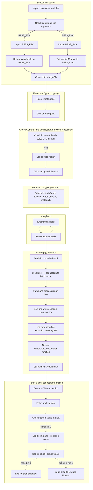
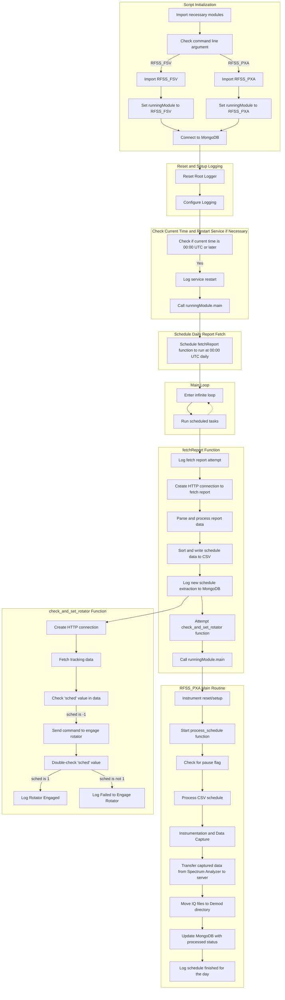

```mermaid
graph TD;
    subgraph "Script Initialization"
        A[Import necessary modules] --> B[Check command line argument]
        B -->|RFSS_FSV| C1[Import RFSS_FSV]
        B -->|RFSS_PXA| C2[Import RFSS_PXA]
        C1 --> D[Set runningModule to RFSS_FSV]
        C2 --> E[Set runningModule to RFSS_PXA]
        D --> F[Connect to MongoDB]
        E --> F
    end

    subgraph "Reset and Setup Logging"
        F --> G[Reset Root Logger]
        G --> H[Configure Logging]
    end

    subgraph "Check Current Time and Restart Service if Necessary"
        H --> I[Check if current time is 00:00 UTC or later]
        I -->|Yes| J1[Log service restart]
        J1 --> J2[Call runningModule.main]
    end

    subgraph "Schedule Daily Report Fetch"
        J2 --> K[Schedule fetchReport function to run at 00:00 UTC daily]
    end

    subgraph "Main Loop"
        K --> L[Enter infinite loop]
        L --> M[Run scheduled tasks]
        M -.-> L
    end

    subgraph "fetchReport Function"
        M --> N[Log fetch report attempt]
        N --> O[Create HTTP connection to fetch report]
        O --> P[Parse and process report data]
        P --> Q[Sort and write schedule data to CSV]
        Q --> R[Log new schedule extraction to MongoDB]
        R --> S[Attempt check_and_set_rotator function]
        S --> T[Call runningModule.main]
    end

    subgraph "check_and_set_rotator Function"
        T --> U[Create HTTP connection]
        U --> V[Fetch tracking data]
        V --> W[Check 'sched' value in data]
        W -->|sched is -1| X[Send command to engage rotator]
        X --> Y[Double-check 'sched' value]
        Y -->|sched is 1| Z[Log Rotator Engaged]
        Y -->|sched is not 1| ZZ[Log Failed to Engage Rotator]
    end
```

```mermaid
graph TD;
    subgraph "Script Initialization"
        A[Import necessary modules] --> B[Check command line argument]
        B -->|RFSS_FSV| C1[Import RFSS_FSV]
        B -->|RFSS_PXA| C2[Import RFSS_PXA]
        C1 --> D[Set runningModule to RFSS_FSV]
        C2 --> E[Set runningModule to RFSS_PXA]
        D --> F[Connect to MongoDB]
        E --> F
    end

    subgraph "Reset and Setup Logging"
        F --> G[Reset Root Logger]
        G --> H[Configure Logging]
    end

    subgraph "Check Current Time and Restart Service if Necessary"
        H --> I[Check if current time is 00:00 UTC or later]
        I -->|Yes| J1[Log service restart]
        J1 --> J2[Call runningModule.main]
    end

    subgraph "Schedule Daily Report Fetch"
        J2 --> K[Schedule fetchReport function to run at 00:00 UTC daily]
    end

    subgraph "Main Loop"
        K --> L[Enter infinite loop]
        L --> M[Run scheduled tasks]
        M -.-> L
    end

    subgraph "fetchReport Function"
        M --> N[Log fetch report attempt]
        N --> O[Create HTTP connection to fetch report]
        O --> P[Parse and process report data]
        P --> Q[Sort and write schedule data to CSV]
        Q --> R[Log new schedule extraction to MongoDB]
        R --> S[Attempt check_and_set_rotator function]
        S --> T[Call runningModule.main]
    end

    subgraph "RFSS_PXA Main Routine"
        T --> U1[Instrument reset/setup]
        U1 --> U2[Start process_schedule function]
        U2 --> U3[Check for pause flag]
        U3 --> U4[Process CSV schedule]
        U4 --> U5[Instrumentation and Data Capture]
        U5 --> U6[Transfer captured data from Spectrum Analyzer to server]
        U6 --> U7[Move IQ files to Demod directory]
        U7 --> U8[Update MongoDB with processed status]
        U8 --> U9[Log schedule finished for the day]
    end

    subgraph "check_and_set_rotator Function"
        R --> X[Create HTTP connection]
        X --> Y[Fetch tracking data]
        Y --> Z[Check 'sched' value in data]
        Z -->|sched is -1| AA[Send command to engage rotator]
        AA --> AB[Double-check 'sched' value]
        AB -->|sched is 1| AC[Log Rotator Engaged]
        AB -->|sched is not 1| AD[Log Failed to Engage Rotator]
    end

```